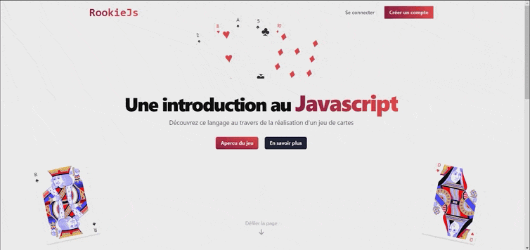

# RookieJs - JsLearningPlatform

Bienvenue sur RookieJs, une plateforme d'apprentissage conçue pour aider les débutants à découvrir le langage JavaScript à travers le développement d'un jeu de cartes. Notre plateforme propose plusieurs cours qui couvrent différents concepts de JavaScript et guident les apprenants dans le processus de construction d'un jeu de cartes entièrement fonctionnel. Malheureusement, en raison d'un manque de temps, nous n'avons pas pu terminer la plateforme d'apprentissage, les cours proposés sont donc incomplet.

Welcome to RookieJs, a learning platform designed to help beginners discover the JavaScript language through the development of a card game. Our platform offers several courses that cover different JavaScript concepts and guide learners through the process of building a fully functional card game. Unfortunately,  we were unable to complete the learning platform due to time constraints, resulting in an incomplete course

## Overview - Homepage

## Features - Pages
- Login System

- List of courses

- Module

